# [Tarot](https://www.lawofone.info/images)

An implementation of the tarot as given by Ra
in [The Law of One](https://www.lawofone.info).
It's a very basic tool for learning the 22 archetypes of the Major Arcana.

It can draw a card at random, and show all cards related to it.
Since it does give additional detail -
one could ask for a card by name or number.

There is also an option to show a table of all cards
organized into Mind/Body/Spirit complex columns
and the 8 classification categories for rows.
This format makes the triples and pairs easy to spot
as one learns the material.

|                                          /                                          |        M i n d         |         B o d y         |       S p i r i t       |
| :---------------------------------------------------------------------------------: | :--------------------: | :---------------------: | :---------------------: |
|                                         ...                                         |        complex         |         complex         |         complex         |
|                                                                                     |                        |                         |                         |
|                         **M<br/>a<br/>t<br/>r<br/>i<br/>x**                         | 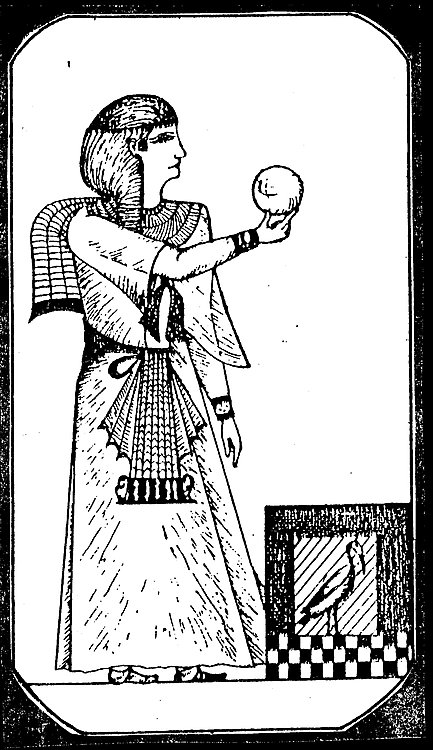 | 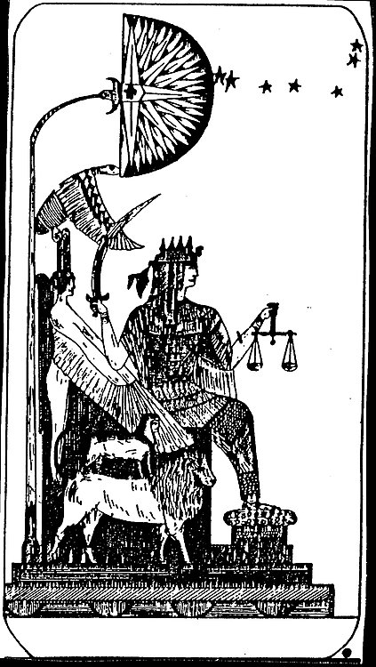  | 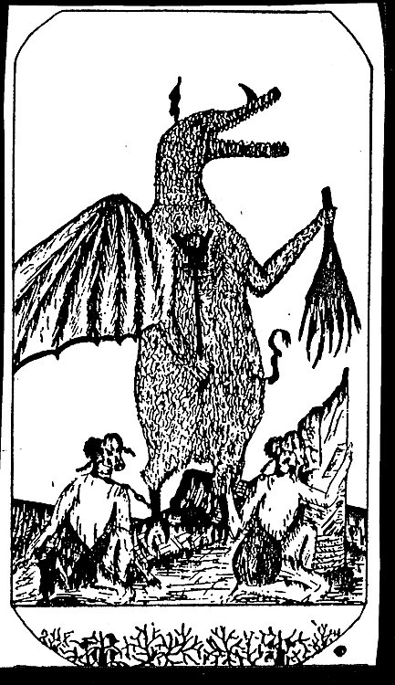 |
|                                                                                     |           :            |            :            |            :            |
|          **P<br/>o<br/>t<br/>e<br/>n<br/>t<br/>i<br/>a<br/>t<br/>o<br/>r**          | 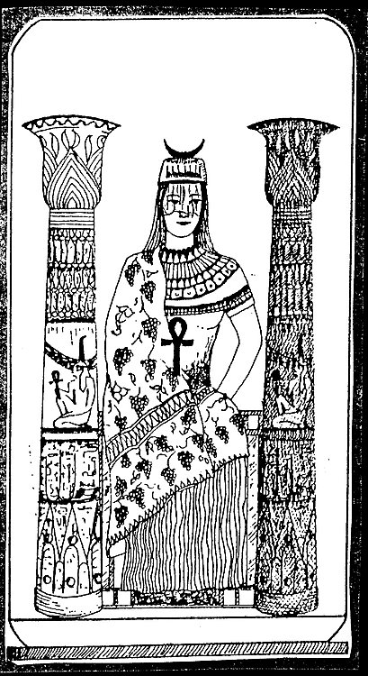 | 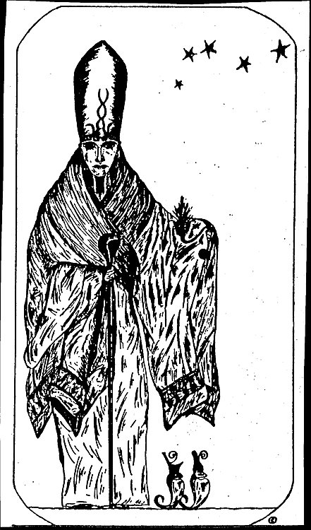  | 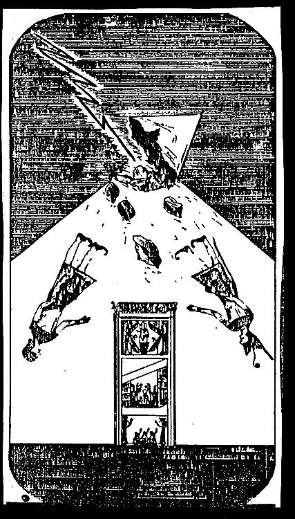 |
|                                                                                     |                        |                         |                         |
|                                                                                     |        &mdash;         |         &mdash;         |         &mdash;         |
|                                                                                     |                        |                         |                         |
|                   **C<br/>a<br/>t<br/>a<br/>l<br/>y<br/>s<br/>t**                   | 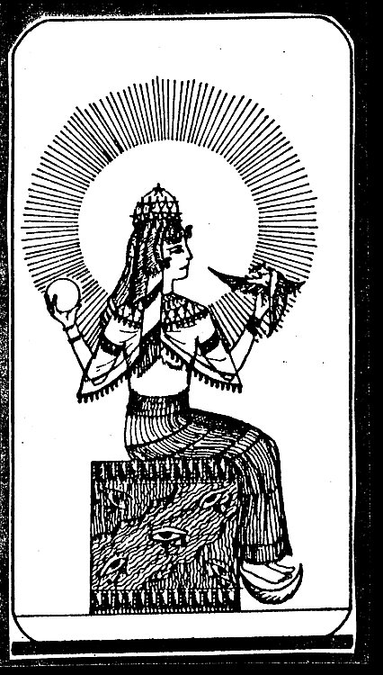 | 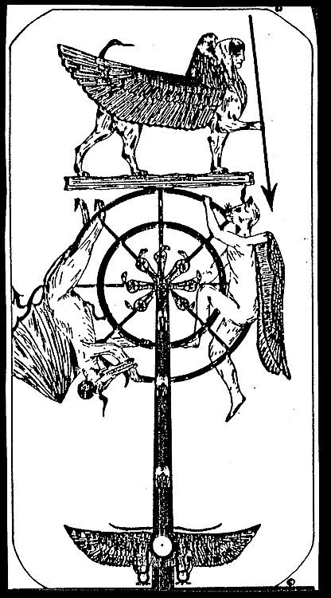 | 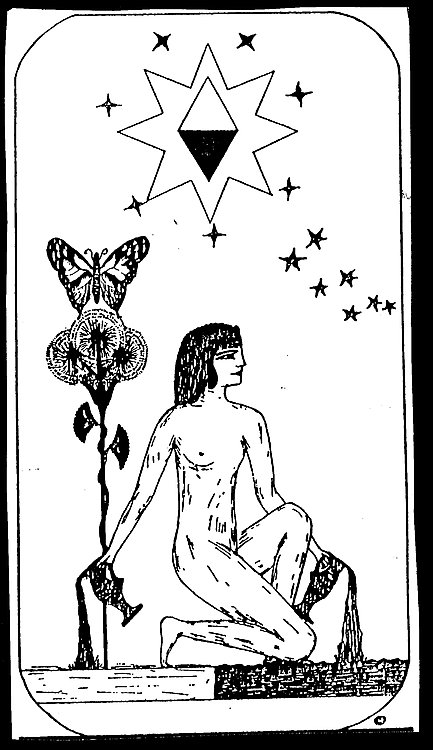 |
|                                                                                     |           :            |            :            |            :            |
|             **E<br/>x<br/>p<br/>e<br/>r<br/>i<br/>e<br/>n<br/>c<br/>e**             | 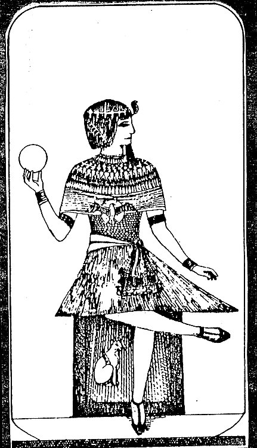 | 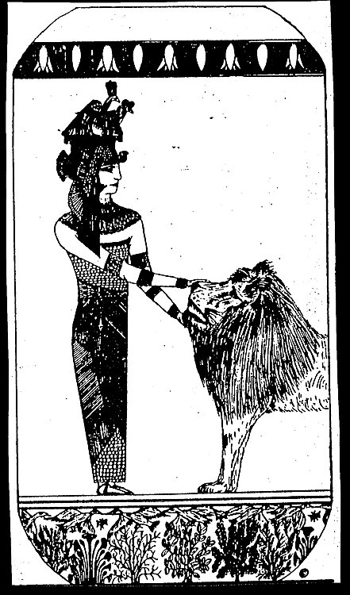 | 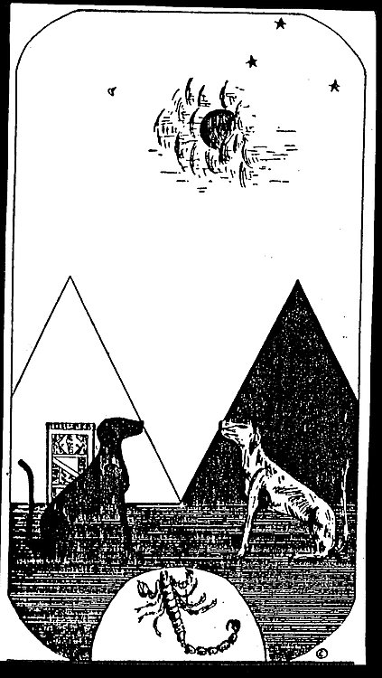 |
|                                                                                     |                        |                         |                         |
|                                                                                     |        &mdash;         |         &mdash;         |         &mdash;         |
|                                                                                     |                        |                         |                         |
|       **S<br/>i<br/>g<br/>n<br/>i<br/>f<br/>i<br/>c<br/>a<br/>t<br/>o<br/>r**       | 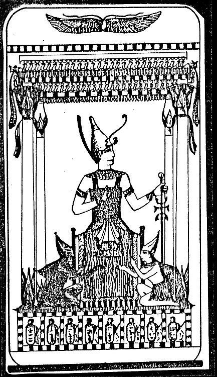 | 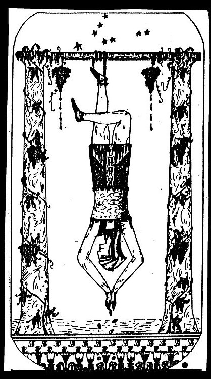 | 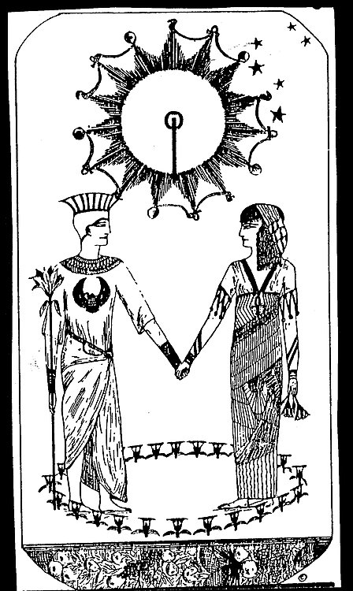 |
|                                                                                     |           :            |            :            |            :            |
|                                        **=**                                        |       **Choice**       |       **Choice**        |       **Choice**        |
|                                                                                     |                        |                         |                         |
|                                                                                     |        &mdash;         |         &mdash;         |         &mdash;         |
|                                                                                     |                        |                         |                         |
| **T<br/>r<br/>a<br/>n<br/>s<br/>f<br/>o<br/>r<br/>m<br/>a<br/>t<br/>i<br/>o<br/>n** | 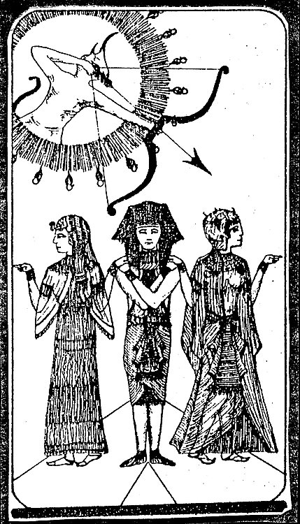 | 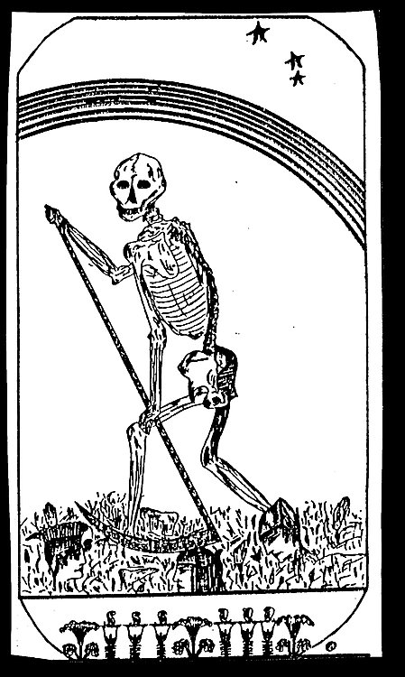 | 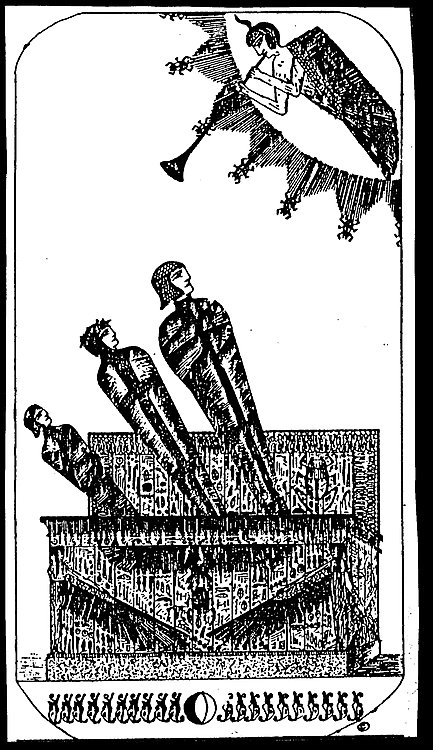 |
|                                                                                     |           :            |            :            |            :            |
|                **G<br/>r<br/>e<br/>a<br/>t<br/><br/>W<br/>a<br/>y**                 | 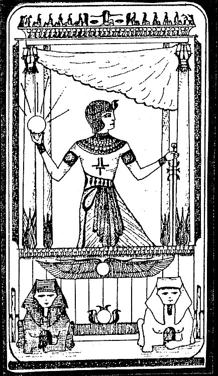 | 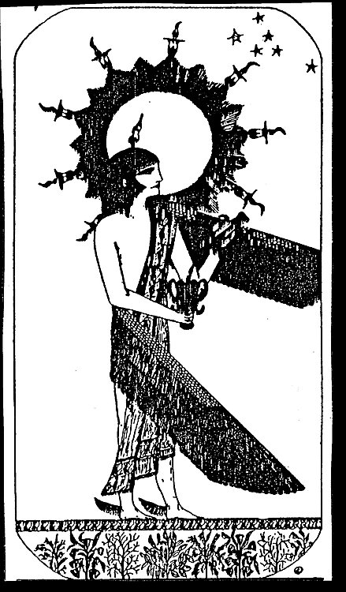 | 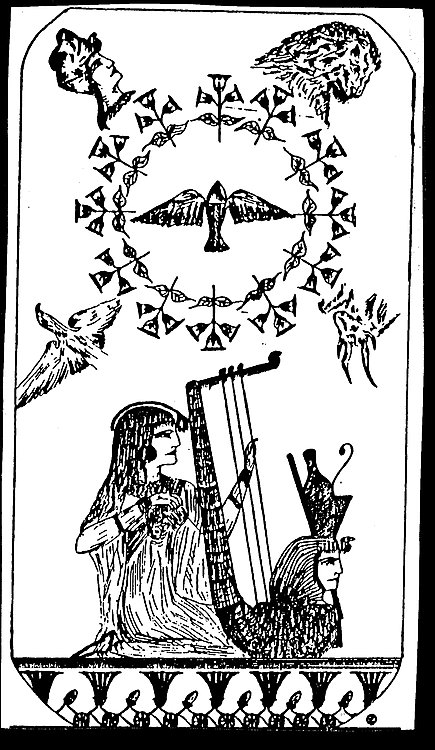 |
|                                                                                     |                        |                         |                         |

## How

[Urbit](https://urbit.org/) would be needed to run this.

It started as a [Hoon School](https://hooniversity.org) final exercise.

So far it's just a generator, which I plan to turn into a Landscape app,
after [learning all of this](https://github.com/timlucmiptev/gall-guide) too.

## Use

The command below, entered in a dojo, generates an overview cheat-sheet.
This is the big picture, usually enough to jog one's memory with.

```
> +tarot, =o %all
~[
  [%all "|                  Mind           | Body             | Spirit    |"]
  [%all "|                                                                |"]
  [%all "| Matrix         | Magician       | Strength         | Devil     |"]
  [%all "| Potentiator    | High Priestess | Hermit           | Tower     |"]
  [%all "| Catalyst       | Empress        | Wheel of Fortune | Star      |"]
  [%all "| Experience     | Emperor        | Justice          | Moon      |"]
  [%all "| Significator   | Hierophant     | Hanged Man       | Sun       |"]
  [%all "| Choice Pairs                                                   |"]
  [%all "| Transformation | Lovers         | Death            | Judgement |"]
  [%all "| Great Way      | Chariot        | Temperance       | World     |"]
  [%all "| The Choice     | Choice                                        |"]
]
```

Here is a default example - I just called `+tarot` to get a random card:

```
~[
  [%upon "| = Archetype  | @ Mind    | Body    | Spirit |"]
  [%upon "|                                             |"]
  [%upon "| Catalyst     | : Empress                    |"]
  [%upon "| Experience > | = Emperor | Justice | Moon   |"]
  [%upon "|                # 4                          |"]
]
```

Above I got the Emperor archetype. It is card #4, of the Mind complex,
which together with Justice for Body and Moon for Spirit represents Experience.
It also pairs with the Empress Catalyst.

To get a specific card, for example the Sun, one could ask for it by name
`+tarot, =name "sun"` or number `+tarot, =a 19`:

```
~[
  [%upon "| = Archetype    | Mind       | Body       | @ Spirit |"]
  [%upon "|                                                     |"]
  [%upon "|                                            # 19     |"]
  [%upon "| Significator > | Hierophant | Hanged Man | = Sun    |"]
  [%upon "| The Choice                                 : Choice |"]
]
```
